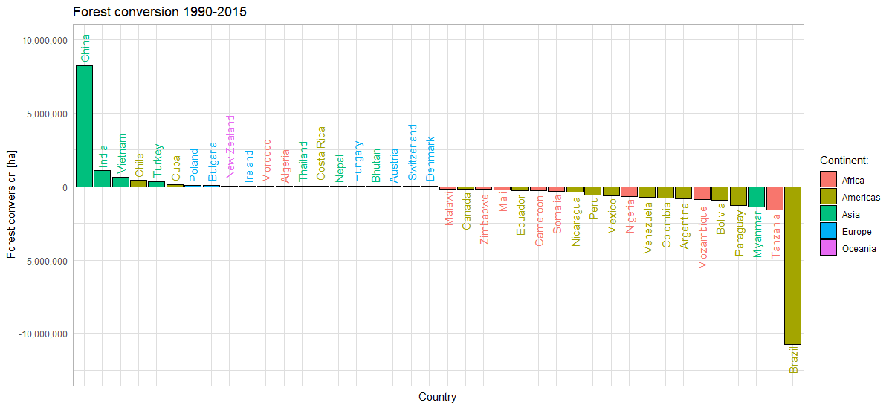
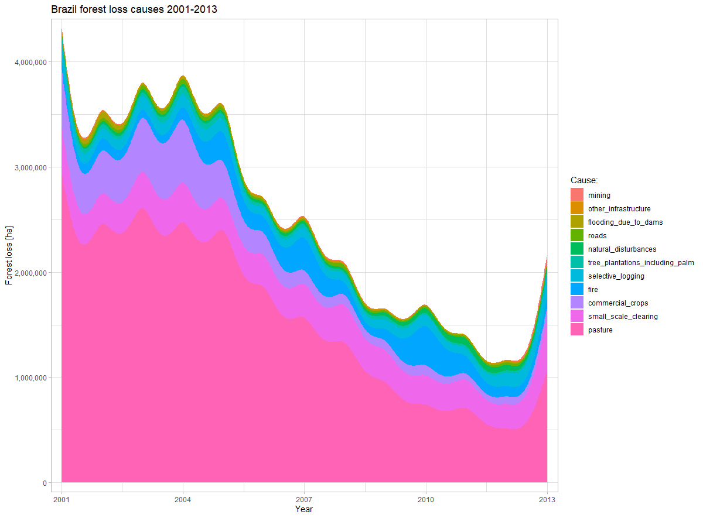
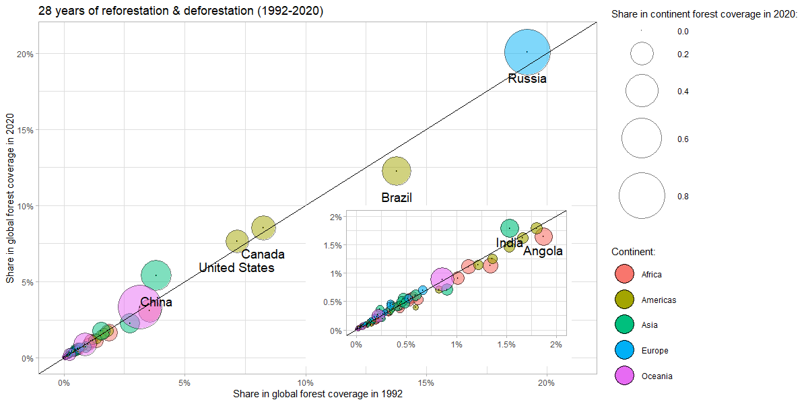

# TIDY TUESDAY
Graphs (and code) for visualizing the data found in https://github.com/rfordatascience/tidytuesday

## WEEK 15 - DEFORESTATION
#### Data:
* [forest.csv](https://github.com/rfordatascience/tidytuesday/tree/master/data/2021/2021-04-06#forestcsv)
* [forest_area.csv](https://github.com/rfordatascience/tidytuesday/tree/master/data/2021/2021-04-06#forest_areacsv)
* [brazil_loss.csv](https://github.com/rfordatascience/tidytuesday/tree/master/data/2021/2021-04-06#brazil_losscsv)
#### Graphs:

